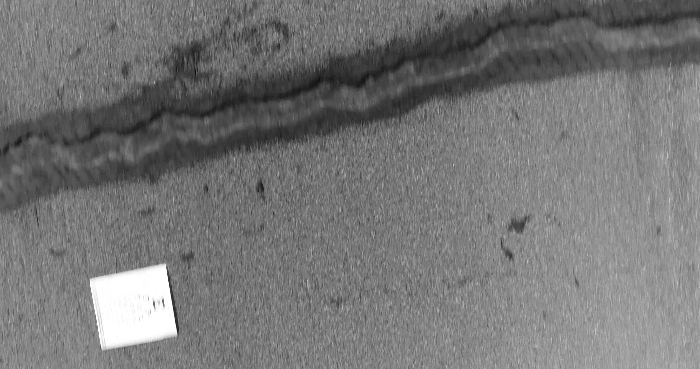
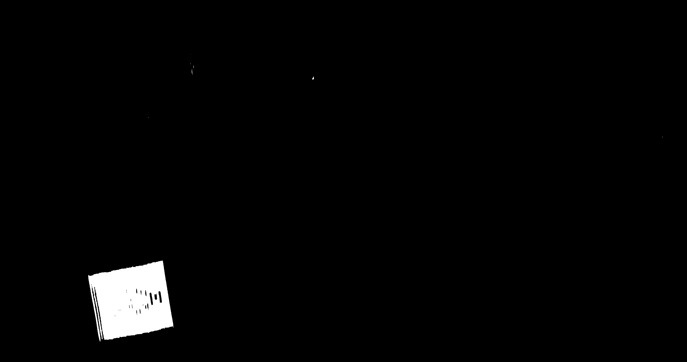

# FOD detection by anomaly detection

A straight forward and simplified implementation of
[Improving Unsupervised Defect Segmentation
by Applying Structural Similarity To Autoencoders](https://arxiv.org/pdf/1807.02011.pdf) 
in application to finding FOD (Foreign Object Debris) on an airport runways.

Simplified using MSE instead of SSIM (Structured Similarity index).

Trained and tested on a small internall dataset collected from a drone flying over a runway with some objects (FOD) placed intentionally.

Currently the inference latencey is ~450 msec/image (4096 x 2016) on a PC (NVIDIA RTX 3090).